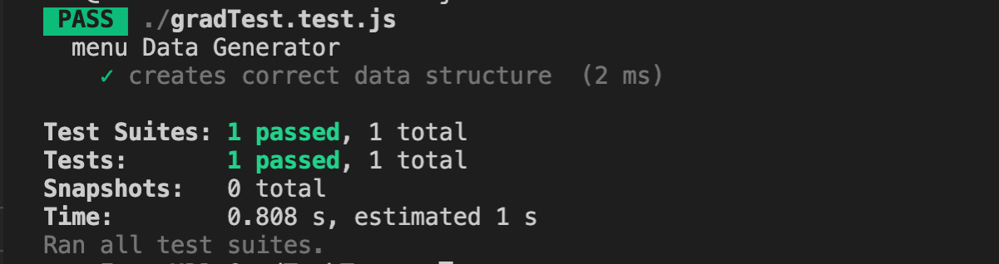

## My approach on the tech test

I decided to use a .map to iterate over the each element of the array.

The data was an array of strings with the format "parent1/parent1child", so I split each string at the forward slash.

If an object with that 'title' key does not exist in the menuData array, then push an object into menuData with the title and data of this element.

If an object in the menuData array already has this title, then push the data for that element into the corresponding data array of the object.

The test is passing.

 
